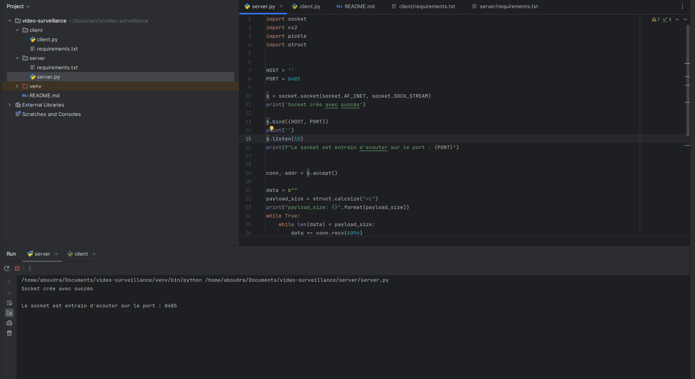
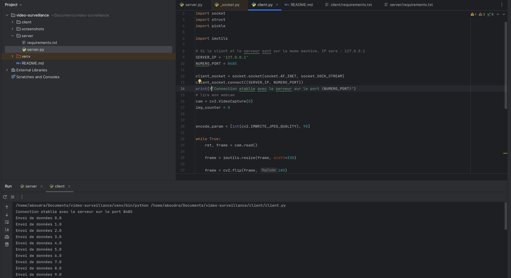
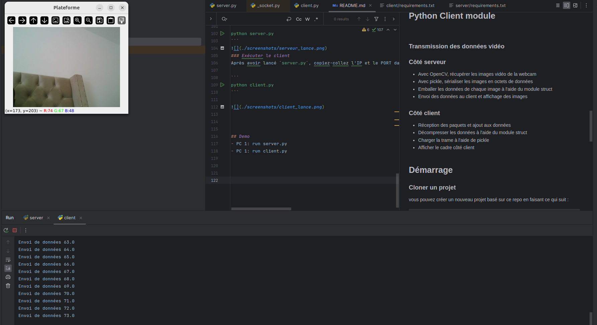
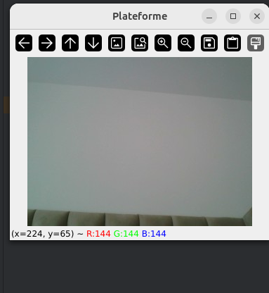

# *Etudiant* :  _SANOU Ana Salimata_

# Projet Tutoré Video de surveillance 
Le projet est composé majoritaiment de deux parties :

### Serveur
Module de reception de la video, il écoute un port  donnée,
une fois il recoit la donnée, il l'affiche sur une fenetre 

### Client
Il s'agit du code python qui va capturer l'image du webcam
dans l'optique de l'envoyer au serveu

## Comment la communication est effectuée ?

La communication est effectuée entre le serveur et le client grace à un socket 
LE socket est une structure logicielle au sein d'un nœud de réseau
qui sert de point d'arrivée pour envoyer et recevoir des données.

## L'implementation des sockets 
Pour l'implementation nous avons opté pour la communication en Streaming 
Car il s'agit de video en flux continu 

Un socket est caracteisé par les points suivants : 
```
socket address 
 * adresse IP
 * numero de port // notre cas 8485
 * type de flux (stream, bloc) // notre cas stream
 * modalité d'envoi : (ip,bluetooth) // notre cas IP
 
```

## Comment trouver l'adresse IP ?
Selon le système d'exploitation, vous pouvez facilement trouver l'adresse IP de votre machine. Allez dans la fenêtre du terminal et exécutez la commande suivante :
#### macOS

```
ipconfig getifaddr en0
```
#### Windows/Linux/Ubuntu

```
ifconfig
```

> Pour les utilisateurs de Windows. L'adresse IP requise s'affichera en regard de l'adresse IPv4.

> Pour les utilisateurs de Linux et Ubuntu. L'adresse IP requise sera celle du réseau local Wifi (inet).

## modèle client-serveur
- Le serveur crée un socket au démarrage
- Peut servir plusieurs clients simultanément
- Un client doit connaître l'IP et le port du serveur


### Transmission des données vidéo
### Côté serveur
- Avec OpenCV, récupérer les images vidéo de la webcam
- Avec pickle, sérialiser les images en octets de données
- Emballer les données de chaque image à l'aide du module struct
- Envoi des données au client et affichage des images

### Côté client
- Réception des paquets et ajout aux données
- Décompresser les données à l'aide du module struct
- Charger la trame à l'aide de pickle
- Afficher le cadre côté client


## Démarrage
### Cloner un projet
vous pouvez créer un nouveau projet basé sur ce repo en faisant ce qui suit :

```
git clone https://github.com/salimataana/video-surveillance.git
```

### Installation
Lorsque c'est fait, installez les dépendances du projet.

```
pip install -r requirements.txt
```

#### Lancer le serveur
Ouvrez le terminal et exécutez `server.py`. Nous allons créer un socket TCP et écouter le port 8485.

```
python server.py
```

### Exécuter le client
Après avoir lancé `server.py`, copiez-collez l'IP et le PORT dans `client.py`. Après avoir fait cela, démarrez le client.

```
python client.py
```




## Demo
- PC 1: run server.py
- PC 1: run client.py




Notons que les deux composants ont été egalement testé sur des machines
differents.


